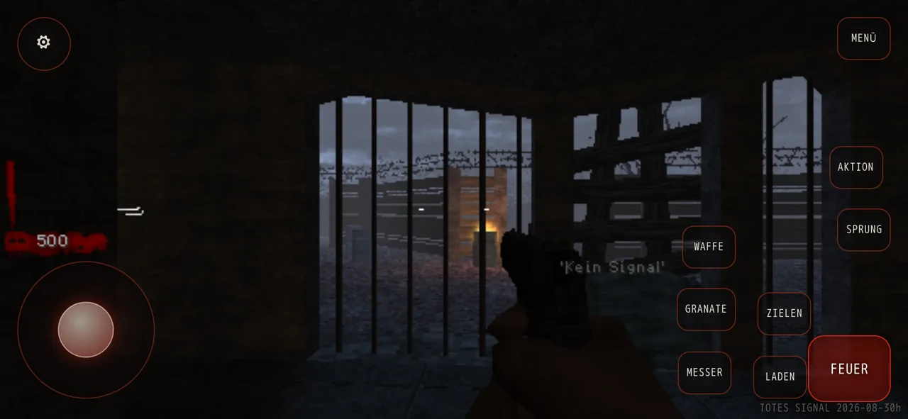
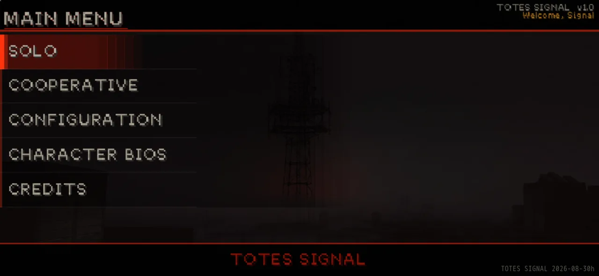

<div align="center">

# TOTES SIGNAL

**Co-op zombie shooter in the browser, rebuilt for phones.**
A fork of [Nazi Zombies: Portable](https://github.com/nzp-team) (NZ:P) with a complete mobile layer,
a settings screen, German localisation, accounts and browser co-op.

[**▶ Play at totersignal.de**](https://totersignal.de) · [Credits](#credits-whats-theirs-whats-mine) · [Roadmap](ROADMAP.md)

<sub>🇩🇪 Koop-Zombie-Shooter im Browser, fürs Handy umgebaut. Fork von Nazi Zombies: Portable, Open Source unter GPL-2.0.</sub>

</div>

> **Work in progress.** Playable, and it looks good, but still in development.
> Expect rough edges; the [roadmap](ROADMAP.md) lists what comes next.

<table>
<tr>
<td width="50%"><a href="https://totersignal.de"></a></td>
<td width="50%"><a href="https://totersignal.de"></a></td>
</tr>
</table>

<sub>Real captures of the live build on a phone profile in landscape. Left: a solo round with the touch controls. Right: the main menu.</sub>

---

## Credits: what's theirs, what's mine

I want this to be unambiguous.

### Theirs: the NZ:P Team

TOTES SIGNAL stands on years of work by the **[NZ:P Team](https://github.com/nzp-team)**:

- **The game itself:** rules, weapons, zombies, perks, maps, models, textures, sounds and music.
- **The game logic** in `quakec/` ([nzp-team/quakec](https://github.com/nzp-team/quakec), GPL-2.0).
  About **92 % of its lines are still unchanged upstream code.**
- **The web version this started from** ([nzp-team/nzp-team.github.io](https://github.com/nzp-team/nzp-team.github.io)).
- **The engine:** [FTEQW](https://fte.triptohell.info/) by Spike and contributors, via
  [nzp-team/fteqw](https://github.com/nzp-team/fteqw). `web/ftewebgl.js` and `web/ftewebgl.wasm` are unmodified builds.

NZ:P credits include blubs, Jukki, cypress, Ju[s]tice, Derped_Crusader, BCDeshiG, Naievil, DR_Mabuse1981,
Scatterbox, Peter0x44 and many more. The full list is in [CREDITS.md](CREDITS.md). Thank you.

### Mine

Everything that turns it into a phone game in the browser, plus the online layer:

- **The complete mobile version.** Upstream's web build had no touch support at all. Added: a virtual joystick
  with auto-sprint and hold-to-crouch, touch buttons for fire (with auto-fire), aim, reload, knife, grenade,
  weapon, jump and action, thumb aim assist and a hybrid aim-lock,
  left-handed mode, haptics, a start gate that unlocks fullscreen, landscape and audio in one tap, a rotate hint
  and dynamic render resolution. (Looking around by dragging uses the engine's own touch handling.)
- **A settings screen:** sensitivity, invert Y, aim assist, button size and opacity, left-handed mode,
  low-power mode, HUD size, brightness presets, AI teammates.
- **An installable app (PWA):** runs offline after the first load and updates itself.
- **Look and feel:** the "Dead Signal" menu redesign, a death screen with stats, a damage-direction indicator
  and a HUD that stays readable on small screens.
- **German localisation** of the game and the web shell.
- **Accounts and a leaderboard** with server-side anti-cheat (`server/`, Fastify and PostgreSQL).
  The 42 achievements that upstream had switched off are back on and stored on the server.
- **Browser co-op over WebRTC:** a browser can host, friends join with a short code, there is a room list
  and an own signalling broker.
- **AI teammates** (`quakec/source/server/ts_bot.qc`) and quick chat.

The web shell (`web/index.html`) grew from 196 lines to about 4,900.

**How it was built:** with [Claude Code](https://claude.com/claude-code) as AI pair programmer. The commit
trailers say so. Direction, design decisions and responsibility are mine.
The menu backgrounds and the death-screen key art are AI-generated.

### Not affiliated

Unofficial, non-commercial fan project. Not affiliated with or endorsed by the NZ:P Team, Activision, Treyarch
or Microsoft. "Call of Duty" is a trademark of Activision Publishing, Inc.

---

## Status

Live at [totersignal.de](https://totersignal.de). Next up, from the [roadmap](ROADMAP.md): Controls 3.0 for
phones, a HUD designed for this game instead of inherited, accessibility, a smaller first download and more
languages.

## Repository layout

| Path | Contents |
| --- | --- |
| `quakec/` | Game logic (QuakeC), fork of [nzp-team/quakec](https://github.com/nzp-team/quakec), GPL-2.0 |
| `web/` | Web shell (`index.html`), FTEQW WebGL engine (`ftewebgl.js/.wasm`), manifest, service worker |
| `web/nzp/` | Runtime game data: `game.pk3` (assets, downloaded, not in git) and `progs.pk3` (built) |
| `server/` | Accounts, runs, leaderboard, anti-cheat (Fastify, PostgreSQL) |
| `config/` | Shipped configs (`autoexec.cfg`, packed into `progs.pk3`) |
| `assets/` | Own menu backgrounds and map overrides |
| `tools/` | Build scripts and the Playwright verification harness (`tools/verify`) |
| `docs/` | Branding, localisation, mobile, upstream pinning, legal notes (mostly in German) |

## Build and run locally

```bash
# Requirements: bash, python3 (pip install pandas fastcrc colorama), zip, curl
tools/assemble-web.sh   # fetch game assets + compile QuakeC
tools/serve.sh          # http://localhost:8080
```

Rebuild only the game logic: `tools/build-progs.sh` (writes `web/nzp/progs.pk3`).

## License

Code: [GPL-2.0](LICENSE), like the upstream it is based on. The game assets (`game.pk3`) are not part of this
repository. They come from NZ:P, carry no licence of their own and are loaded at runtime. See
[docs/LEGAL.md](docs/LEGAL.md) and [CREDITS.md](CREDITS.md).

---

<sub>Maintained by Darius Hofman · <a href="https://kaufmeinewebsite.de">kaufmeinewebsite.de</a> · Impressum: <a href="https://kaufmeinewebsite.de/legal#impressum">kaufmeinewebsite.de/legal</a></sub>
